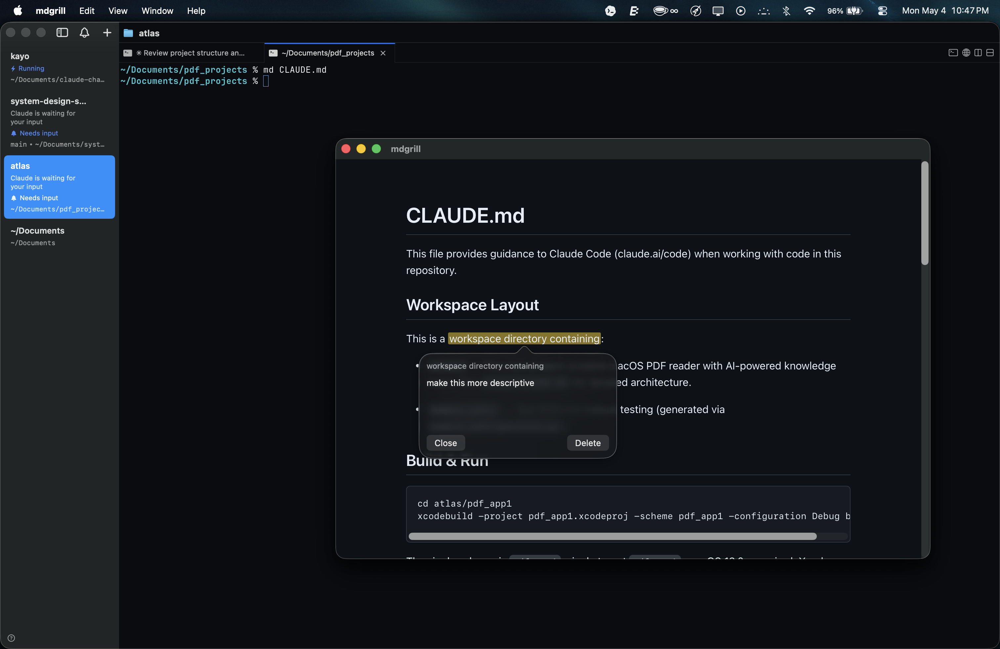

# markit

**Annotate markdown files on macOS.** Highlight text, add comments, export everything to your clipboard. Your source files are never touched.

A lightweight, native macOS markdown annotation tool built with Swift and SwiftUI. Read markdown with rendered previews, select passages, attach notes, and export annotated quotes — perfect for code review, document feedback, research notes, and editorial markup. No Electron, no web app, no account required.

## Screenshot



**Key features:**
- Render any `.md` file with full GitHub-flavored markdown support
- Select text and attach inline comments
- Yellow highlights mark all annotations
- Export all quote+comment pairs to clipboard in one shortcut
- Annotations stored in sidecar JSON — source files are never modified
- Dark mode support
- Configurable keyboard shortcuts
- Small native app, launches instantly

## Download

Grab the latest release from [GitHub Releases](https://github.com/rogue-socket/markit/releases/latest).

1. Download `markit-macos.zip`
2. Unzip and drag `markit.app` to `/Applications`
3. (Optional) Add the CLI shim to your PATH:
   ```sh
   curl -sL https://raw.githubusercontent.com/rogue-socket/markit/main/markit -o /usr/local/bin/markit && chmod +x /usr/local/bin/markit
   ```

## Build from source

```sh
make build
```

Produces `.build/markit.app`.

## Build release zip

```sh
make dist
```

Produces `.build/markit-macos.zip`. The app is ad-hoc signed locally, so macOS may require approving the first launch from Privacy & Security after download.

## Install from source

```sh
make install
```

Copies the app to `/Applications/markit.app`.

Then copy the CLI shim to somewhere on your PATH:

```sh
cp markit /usr/local/bin/markit
```

## Usage

```sh
markit path/to/file.md
```

Opens the file rendered in a single window. Close the window to quit.

### Annotating

| Action | Shortcut |
|--------|----------|
| Add comment | Cmd+Shift+C |
| Save comment | Cmd+Return |
| Cancel | Esc |
| Export all to clipboard | Cmd+E |
| Edit comment | Click highlight → edit text → Save |
| Delete annotation | Click highlight → Delete |

Select text, press Cmd+Shift+C, type your comment, press Cmd+Return. A yellow highlight marks the annotation. Click any highlight to view, edit, or delete it.

### Export format

Cmd+E copies all annotations to the clipboard as:

```
> quoted text

your comment

---
```

### Storage

Annotations are stored in `~/.markit/annotations/<hash>.json` (one file per source document, keyed by SHA-256 of the absolute path). Source `.md` files are never modified.

### Data on disk

The only files markit writes are in `~/.markit/`:

```
~/.markit/
├── annotations/          # one JSON file per annotated document
│   ├── <sha256>.json
│   └── ...
└── config.json           # optional shortcut overrides
```

No temp files, no caches, no background processes. Closing the window (Cmd+W) terminates the app and frees all memory. Sidecar JSONs remain on disk so annotations survive restarts.

```sh
# See what's accumulated:
ls -lh ~/.markit/annotations/

# Remove annotations for a specific file:
rm ~/.markit/annotations/<hash>.json

# Remove all annotations:
rm -rf ~/.markit/annotations/
```

## Configuration

Edit `~/.markit/config.json` to override shortcuts:

```json
{
  "shortcuts": {
    "add_comment": "cmd+shift+c",
    "export": "cmd+e"
  }
}
```

Supported modifiers: `cmd`, `shift`, `alt`/`option`, `ctrl`. Changes take effect on relaunch.

## Development

Rebuild and relaunch in one step:

```sh
make run FILE=/path/to/file.md
```

This kills any running instance, rebuilds, and opens the app with the given file.

## Requirements

- macOS 13+
- Swift 5.9+
- Xcode Command Line Tools
